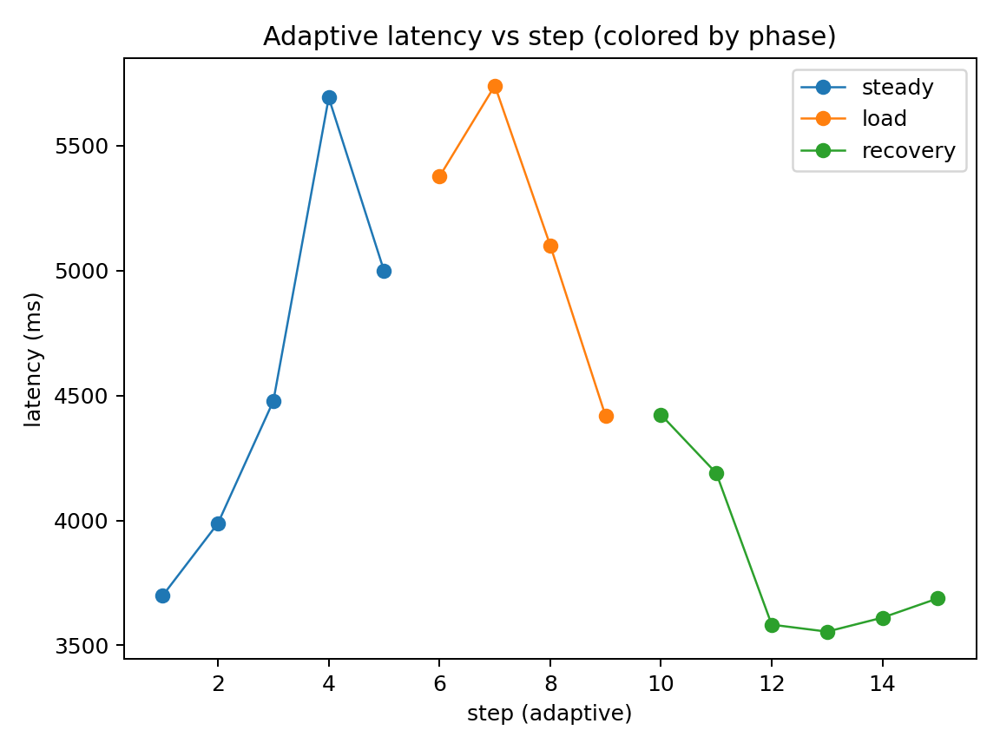
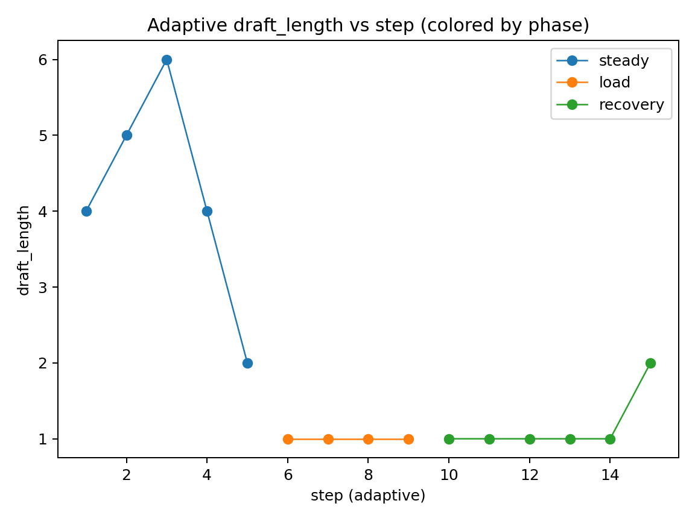
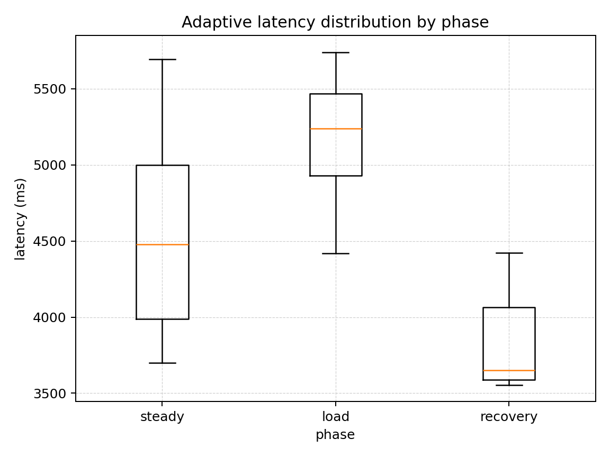
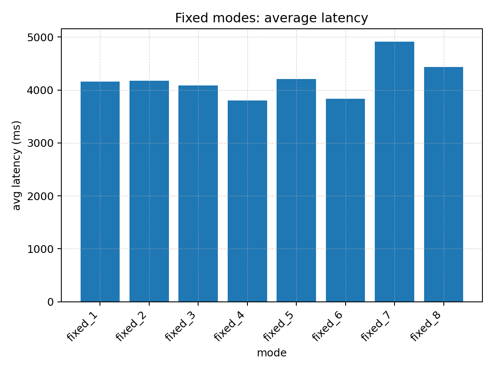
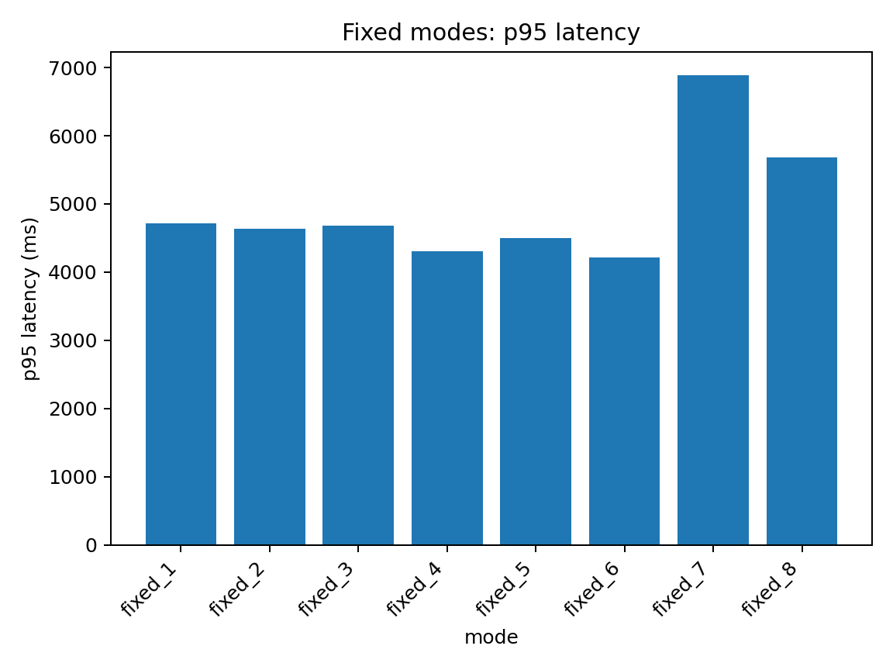
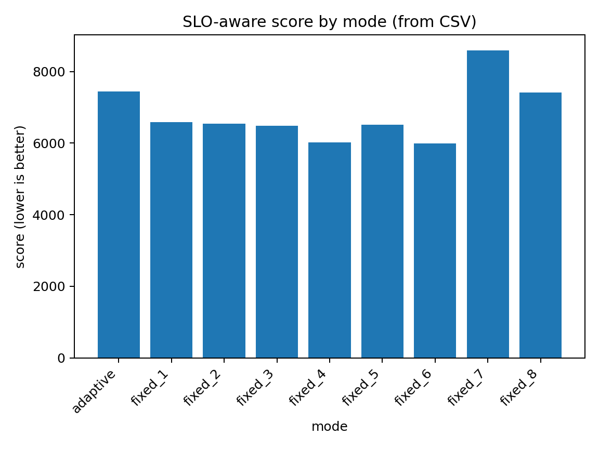

# HaloSpec

Rust benchmark harness for speculative decoding **draft_length** strategies against the Lemonade inference engine.

## Goal

Measure latency/throughput + stability tradeoffs across:

- fixed_1 .. fixed_8
- adaptive controller (warmup-calibrated thresholds, SLO-aware scoring)
- optional CPU load injection for contention experiments

## How it works (high level)

Each mode:

1. Warmup (WARMUP_STEPS, not logged)
2. Measured steps (CSV logging)
3. Summary stats + SLO-aware score
4. Adaptive: tracks draft_length changes + convergence

## Metrics

- avg / median / p95 / min / max / stddev latency
- throughput (tokens/sec from completion_tokens)
- success rate
- adaptive: draft change count, convergence_step(k)

## Load injection (adaptive only)

Enable with:

- `HALOSPEC_LOAD=1`
  Behavior:
- does **not** run during warmup
- starts at measured step 6
- duration ~30s
  Purpose: test controller stability under contention.

## Running

```bash
# Fixed sweep + adaptive
cargo run

# With load injection
HALOSPEC_LOAD=1 cargo run

# Optional verbose JSON
HALOSPEC_DEBUG_JSON=1 cargo run
```

## Experimental Results (Load Injection)

These plots are generated from `results_phase0.csv` with `HALOSPEC_LOAD=1`, where CPU contention is injected starting at measured step 6 for ~30s. Phases are logged as `steady`, `load`, and `recovery`.

### Adaptive latency vs step (phase-colored)



### Adaptive draft_length vs step (phase-colored)



### Adaptive latency distribution by phase



### Fixed modes: average latency



### Fixed modes: p95 latency



### SLO-aware score by mode



## Key Takeaways

- Load injection produces a measurable latency elevation during the `load` phase followed by stabilization in `recovery`.
- The adaptive controller remains stable (bounded draft_length changes) and converges after the perturbation window.
- Fixed draft_length modes can outperform adaptive in some runs; the project frames this as a non-stationary tuning problem under runtime variability.
